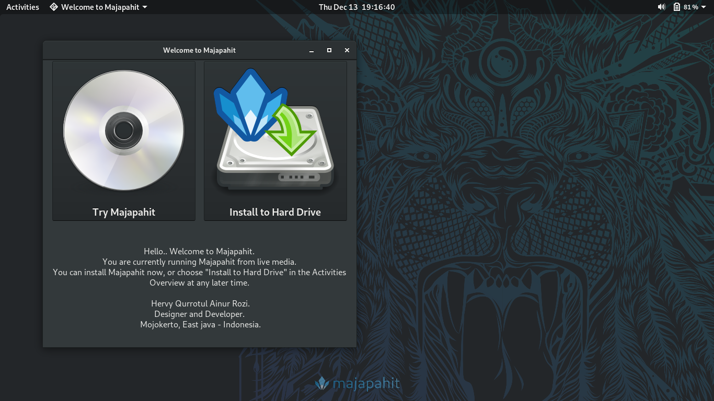
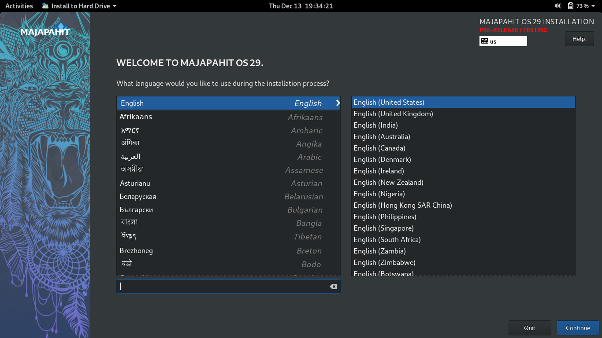
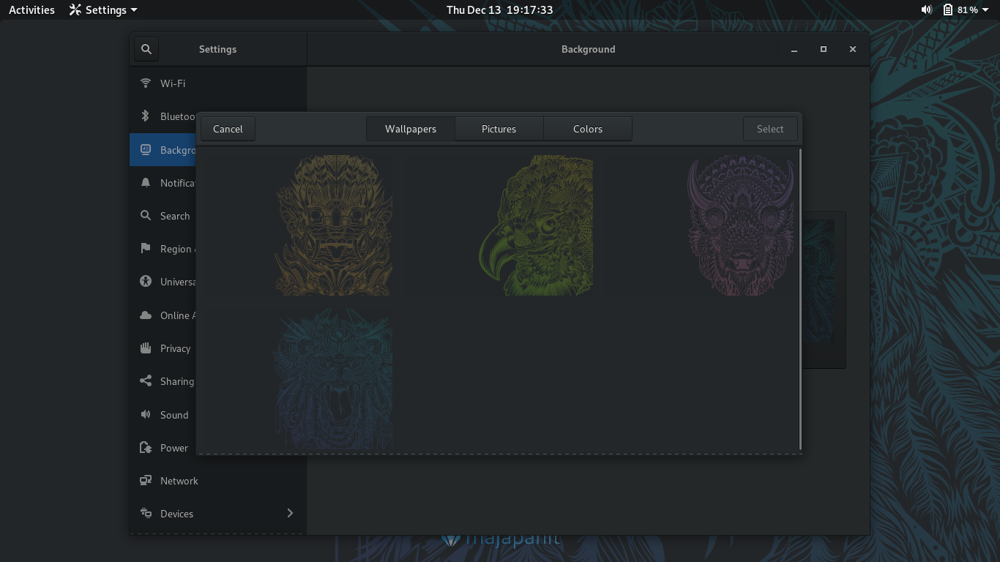
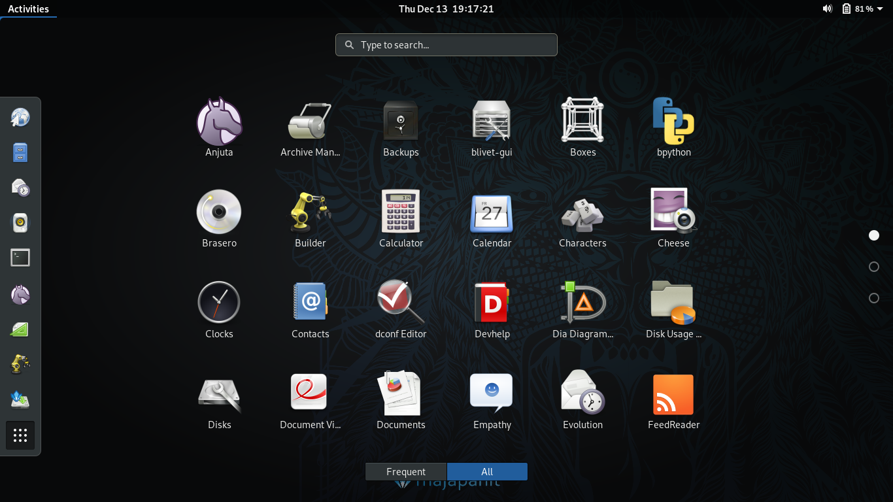

# Majapahit release 29

Majapahit is linux based on Fedora.

## 1. Majapahit available in two variants

|Contain| - Standard -| Developer -|
|:----:|:----:|:----:|
| RPM-Fusion | `x` | `x` |
| Codec | `x` | `x` |
| Compression | `x` | `x` |
| Libreoffice | `x` | `x` |
| Gimp, Inkscape (+Plugins) | `x` | `x` |
| Gnome Apps | `x` | `x` |
| Vino (remote desktop) | `x` | `x` |
| Gnome-boxes (virtual) | `x` | `x` | 
| LAMP (Php, Nginx, Mariadb) |  | `x` |
| C | | `x` |
| GTK | | `x` |
| Gnome IDE (Anjuta, Builder, Glade) | | `x` |
| Python Classroom |  | `x` |
| Python Science |  | `x` |
| Django |  | `x` |
| Ruby |  | `x` |
| Ruby on rails |  | `x` |

## 2. Gnome-control-center

|Tweaks| > Fedora | > Majapahit|
|:----:|:----:|:----:|
| Dark theme (default) | no | yes |
| Night light enabled | no | yes |
| Tap to click | no | yes |
| Nautilus : folder first | no | yes |
| Nautilus : encrypt/decript | no | yes |
| Plugins : suspend button | no | yes |
| Plugins : alternate tab | no | yes |

## 3. Screenshoot

### 3.1 Welcome

### 3.1 Anaconda installer

### 3.3 Wallpaper

### 3.4 Menu (developer)

