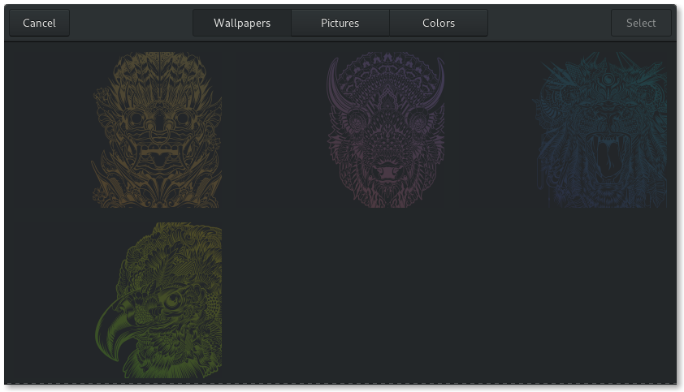
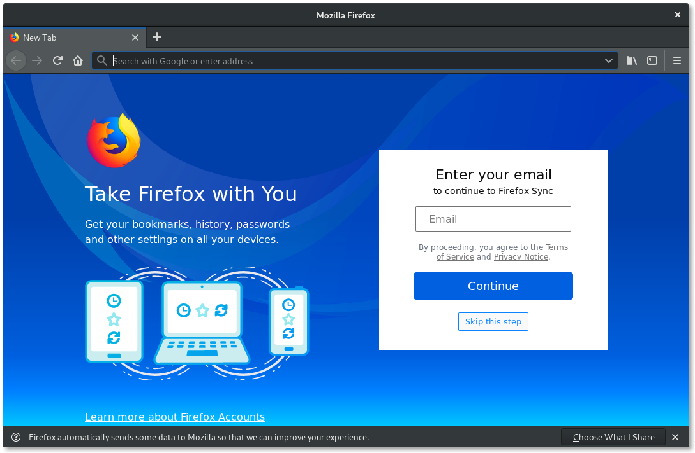
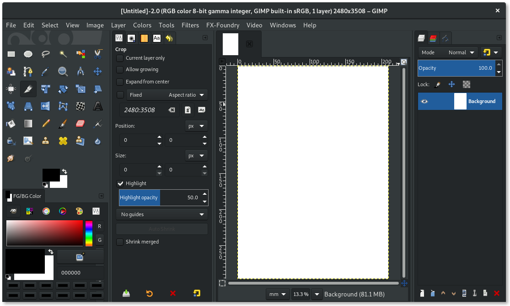
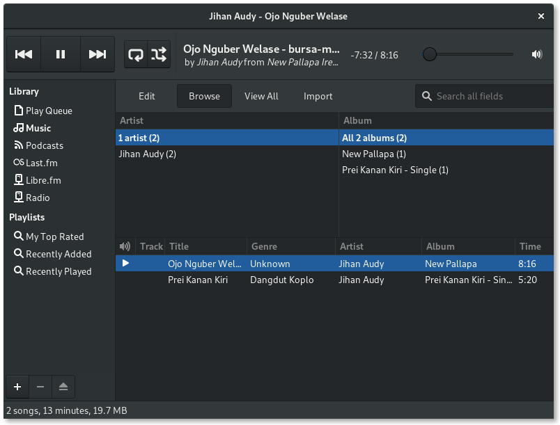
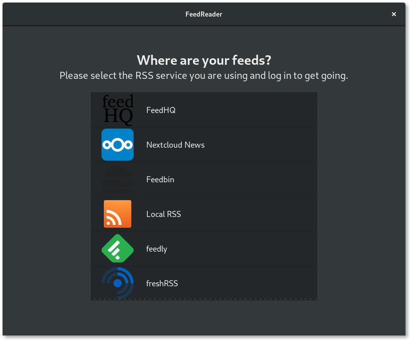
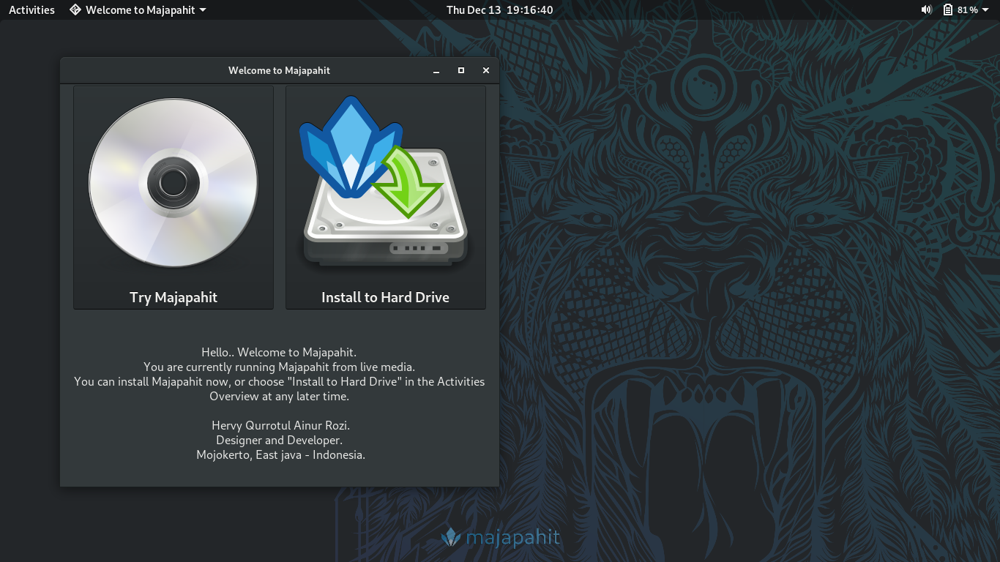
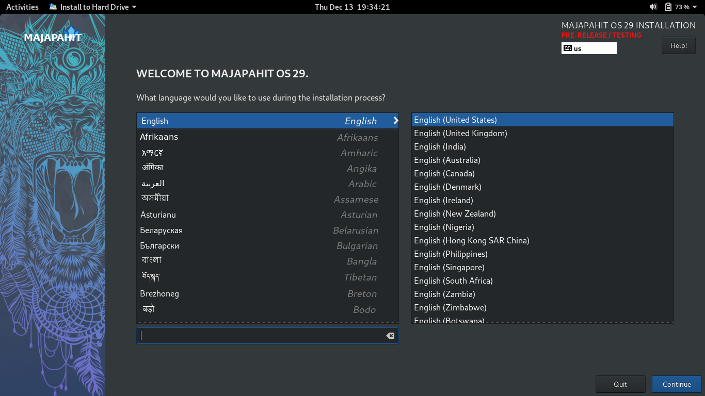
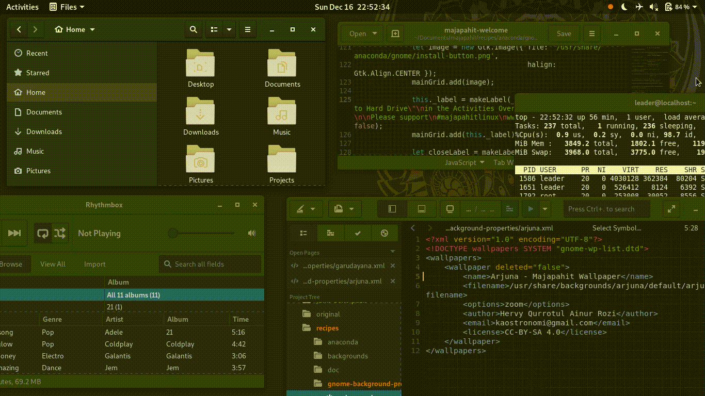

# Majapahit release 29.1.2

Majapahit is a hobby project based on Fedora Linux.

The computer on which you intend to install Majapahit 29 from the live CD should have:

- a DVD or USB drive (minimum 4Gib), and the capability to boot from this drive.
- a 1 GHz processor or faster
- at least 2 GB of memory (RAM)

## 1. Majapahit available in two variants

|Contain| - Workstation -|- Developer -|
|:----:|:----:|:----:|
| RPM-Fusion | yes | yes |
| Codec | yes | yes |
| Compression | yes | yes |
| Libreoffice | yes | yes |
| Gimp, Inkscape (+Plugins) | yes | yes |
| Gnome Apps | yes | yes |
| Vino (remote desktop) | yes | yes |
| Gnome-boxes (virtual) | yes | yes | 
| LAMP (Php, Nginx, Mariadb) |  | yes |
| C | | yes |
| GTK | | yes |
| Gnome IDE (Anjuta, Builder, Glade) | | yes |
| Python Classroom |  | yes |
| Python Science |  | yes |
| Django |  | yes |
| Ruby |  | yes |
| Ruby on rails |  | yes |
| Golang |  | yes |
| Hugo |  | yes |

## 2. Download 

### Workstation edition 29.1.2

#### Download Workstation edition :
https://osdn.net/projects/majapahit/downloads/70404/Majapahit-Workstation-Live-29.1.2.iso/

| Note | Value |
|:----:|:----:|
| File Name | Majapahit-Workstation-Live-29.1.2.iso |
| File Size | 2.621.161.472 bytes |
| MD5 | 65f0ae9d80e63b85ed86bfe58f95896c |
| SHA1 | 0ca679b64632a7e3165e27a26eab5dfde886642d |
| SHA256 | 96cbf431708d419813b5f65f6c23e3812d18b7ea2899d978c1900692334bba85 |

### Developer edition 29.1

- This edition for Developer : C, Python, Ruby, and Web dev (php5, nginx, mariadb)
- IDE : Anjuta studio, Builder, Glade

#### Download Developer edition :
https://osdn.net/projects/majapahit/downloads/70404/Majapahit-Developer-Live-29.1.2.iso/

| Note | Value |
|:----:|:----:|
| File Name | Majapahit-Developer-Live-29.1.2.iso |
| File Size | 3.352.166.400 bytes |
| MD5 | 6fc8e42db57ec783da0f19bde41c24f9 |
| SHA1 | 378ce4aaad8bc3842be9f85156c94bcd5fd138dd |
| SHA256 | da95ddaf6014b24043e73bcfe7c0087c43d38073bb02213de35c65991f07b394 |

## 3. Example Image writing

### For Windows

- [Rufus](https://rufus.ie/en_IE.html "Rufus download") or
- [LiliUSB](http://www.linuxliveusb.com/en/download "LiliUSB download")

### For Linux

| Apps | Fedora | Debian-Ubuntu | Manjaro-Arch |
|:----:|:----:|:----:|:----:|
| multiwriter | dnf install multiwriter | apt-get install multiwriter | pacman -S multiwriter |, or
| gnome-multi-writer | dnf install gnome-multi-writer | apt-get install gnome-multi-writer | pacman -S gnome-multi-writer |, or
- use dd command (example):
```
sudo dd bs=1M if=Majapahit-Workstation-Live-29.1.2.iso of=/dev/sdb status=progress
```

## 4. Gnome-control-center

|Tweaks| Fedora | Majapahit|
|:----:|:----:|:----:|
| Dark theme (default) | no | yes |
| Tap to click | no | yes |
| Nautilus : folder first | no | yes |
| Nautilus : encrypt/decript | no | yes |
| Plugins : suspend button | no | yes |
| Plugins : alternate tab | no | yes |

## 5. Screenshoot

### Wallpaper


### New Wallpaper (29.1.2)


### Browser


### GIMP


### Music Player


### FeedReader


### Welcome


### Anaconda installer


## 6. Screencast

### Lightmode / Darkmode

