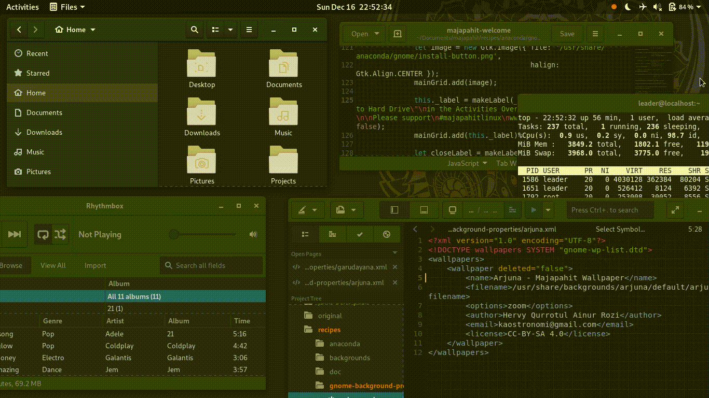

# Majapahit release 29

Majapahit is a hobby project based on Fedora Linux.

The computer on which you intend to install Majapahit 29 from the live CD should have:

- a DVD or USB drive (4Gib), and the capability to boot from this drive.
- a 1 GHz processor or faster
- at least 1 GB of memory (RAM)

## 1. Majapahit available in two variants

|Contain| - Standard -| Developer -|
|:----:|:----:|:----:|
| RPM-Fusion | yes | yes |
| Codec | yes | yes |
| Compression | yes | yes |
| Libreoffice | yes | yes |
| Gimp, Inkscape (+Plugins) | yes | yes |
| Gnome Apps | yes | yes |
| Vino (remote desktop) | yes | yes |
| Gnome-boxes (virtual) | yes | yes | 
| LAMP (Php, Nginx, Mariadb) |  | yes |
| C | | yes |
| GTK | | yes |
| Gnome IDE (Anjuta, Builder, Glade) | | yes |
| Python Classroom |  | yes |
| Python Science |  | yes |
| Django |  | yes |
| Ruby |  | yes |
| Ruby on rails |  | yes |

## 2. Download 

### Standard edition 29.1
https://osdn.net/projects/majapahit/downloads/70404/Majapahit-Linux-std-x86_64-29.1.iso/

| Note | Value 
|:----:|:----:|
| File Name | Majapahit-Linux-std-x86_64-29.1.iso |
| File Size | 2,824,273,920 bytes |
| MD5 | 3ead0d64a736619c65986a6e24102efb |
| SHA1 | c826a95aab8d7ccc9e1955eef9e198a21cabe0e3 |
| SHA256 | 0b84a52ce0363b1fa7e60195a5444035da9c885f45f7bbf596b9184b89a40d51 |

### Developer edition 29.1
https://osdn.net/projects/majapahit/downloads/70404/Majapahit-Linux-dev-x86_64-29.1.iso/

| Note | Value 
|:----:|:----:|
| File Name | Majapahit-Linux-dev-x86_64-29.1.iso |
| File Size | 3,365,634,048 bytes |
| MD5 | d5cec1d8d3dfecf0e6de9c7bbc4f4343 |
| SHA1 | 7a5b90cefd8a2866849d386147e6ed34274187e0 |
| SHA256 | 0eb04910a33ed4ee0751ffd30c3ad67c8140be3e36e30fb28bc141ffd900c527 |

## 3. Example Image writing

### For Windows

- [Rufus](https://rufus.ie/en_IE.html "Rufus download") or
- [LiliUSB](http://www.linuxliveusb.com/en/download "LiliUSB download")

### For Linux

- multiwriter,
- gnome-multiwriter or
- use command
```
sudo dd bs=1M if=Majapahit-Linux-std-x86_64-29.1.iso of=/dev/sdb
```

## 4. Gnome-control-center

|Tweaks| Fedora | Majapahit|
|:----:|:----:|:----:|
| Dark theme (default) | no | yes |
| Night light enabled | no | yes |
| Tap to click | no | yes |
| Nautilus : folder first | no | yes |
| Nautilus : encrypt/decript | no | yes |
| Plugins : suspend button | no | yes |
| Plugins : alternate tab | no | yes |


## 5. Screenshoot

### Wallpaper


### Browser


### GIMP


### Music Player


### FeedReader


### Welcome


### Anaconda installer


## 6. Screencast

### Lightmode / Darkmode

